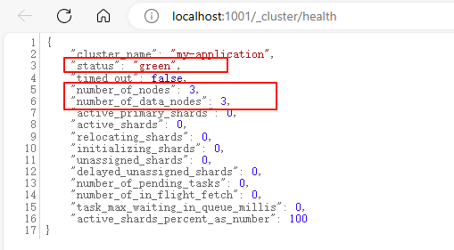
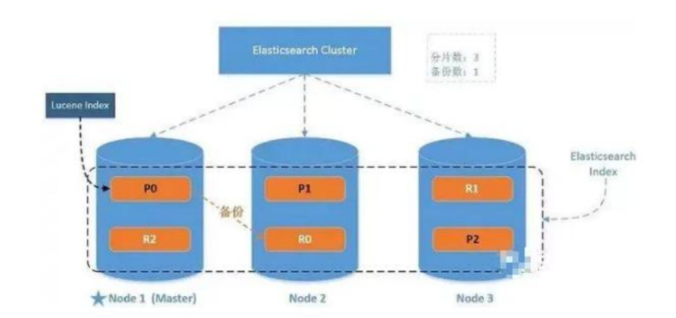

## start

[TOC]

## ES 数据库的基本概念

### 倒排索引的搜索流程

倒排索引的**搜索流程**如下（以搜索"华为手机"为例）：

1）用户输入条件`"华为手机"`进行搜索。

2）对用户输入内容**分词**，得到词条：`华为`、`手机`。

3）拿着词条在倒排索引中查找，可以得到包含词条的文档id：1、2、3。

4）拿着文档id到正向索引中查找具体文档。

> 虽然要先查询倒排索引，再查询倒排索引，但是无论是词条、还是文档id都建立了索引，查询速度非常快！无需全表扫描。

### 正向和倒排索引的对比(优缺点)

概念区别：

- **正向索引**是最传统的，根据id索引的方式。但根据词条查询时，必须先逐条获取每个文档，然后判断文档中是否包含所需要的词条，是**根据文档找词条的过程**。
- 而**倒排索引**则相反，是先找到用户要搜索的词条，根据词条得到保护词条的文档的id，然后根据id获取文档。是**根据词条找文档的过程**。

优缺点：

**正向索引**：

- 优点：
  - 可以给多个字段创建索引
  - 根据索引字段搜索、排序速度非常快
- 缺点：
  - 根据非索引字段，或者索引字段中的部分词条查找时，只能全表扫描。

**倒排索引**：

- 优点：
  - 根据词条搜索、模糊搜索时，速度非常快
- 缺点：
  - 只能给词条创建索引，而不是字段
  - 无法根据字段做排序

### MySQL与ES

| **MySQL** | **Elasticsearch** | **说明**                                                     |
| --------- | ----------------- | ------------------------------------------------------------ |
| Table     | Index             | 索引(index)，就是文档的集合，类似数据库的表(table)           |
| Row       | Document          | 文档（Document），就是一条条的数据，类似数据库中的行（Row），文档都是JSON格式 |
| Column    | Field             | 字段（Field），就是JSON文档中的字段，类似数据库中的列（Column） |
| Schema    | Mapping           | Mapping（映射）是索引中文档的约束，例如字段类型约束。类似数据库的表结构（Schema） |
| SQL       | DSL               | DSL是elasticsearch提供的JSON风格的请求语句，用来操作elasticsearch，实现CRUD |

## ES RestAPI基础操作

ES的对外访问路径：http://localhost:9200/

### 索引(表)的操作

- 创建索引库：PUT /{索引库名}
- 查询索引库：GET /{索引库名}
  - 查询所有的索引列表：GET /_cat/indices?v
- 删除索引库：DELETE /{索引库名}
- 修改索引库（添加字段）：PUT /{索引库名}/_mapping

### 文档(行)的操作

#### 简单CRUD

- 创建文档：POST /{索引库名}/_doc`/文档id`	不指定文档id将会自动生成

  - ```json
    {
    	"title":"小米手机",
    	"category":"小米",
    	"images":"http://www.gulixueyuan.com/xm.jpg",
    	"price":3999.00
    }
    ```

  - 其他格式：PUT /{索引库名}/_create/文档id

- 查询文档：GET /{索引库名}/_doc/文档id

  - 查询该索引所有的文档：GET /{索引库名}/_search

- 删除文档：DELETE /{索引库名}/_doc/文档id

- 修改文档：

  - 全量修改：PUT /{索引库名}/_doc/文档id
  - 增量修改：POST /{索引库名}/_update/文档id         { "doc": {字段:值}}

#### 条件查询

- 基于请求参数的条件查询：GET /{索引库名}/_search?q={字段:值}

- 基于请求体的条件查询：GET /{索引库名}/_search

  - 全量查询：

    ```json
    {
        "query" : {
            "match_all" : {
                
            }
        }
    }
    ```

  - 单字段匹配：

    ```json
    {
        "query" : {
            "match" : {
                "字段" : "值"
            }
        }
    }
    ```

  - 分页查询：

    ```json
    {
        "query" : {
            "match_all" : {
            }
        },
        "from" : 0,		//(pageNum - 1) * size
        "size" : 2
    }
    ```

  - 只查询部分字段：

    ```json
    {
        "query" : {
            "match_all" : {
            }
        },
        "_source" : ["字段"]
    }
    ```

  - 排序：

    ```json
    {
        "query" : {
            "match_all" : {
            }
        },
        "sort" : {
            "字段" : {
                "order" : "desc"
            }
        }
    }
    ```

  - 多条件组合查询（与、或、范围查询）：

    ```json
    {
        "query" : {
            "bool" : {
                //must: &&
                //should: ||
                "must" : [
                    {
                        "match" : {
                            "字段" : "值"
                        }
                    },
                    {
                        "match" : {
                            "字段" : "值"
                        }
                    }
                ],
                "filter" : {
                    "range" : {
                        "字段" : {
                            "gt" : 4000
                        }
                    }
                }
            }
        }
    }
    ```

  - 高亮显示查询字段：

    ```json
    {
        "query" : {
            "match" : {
                "字段" : "值"
            }
        },
        "highlight" : {
            "fields" : {
                "字段1" : {},
                "字段2" : {}
            }
        }
    }
    ```

  - 前面的查询默认都会对字段的值进行拆词，然后进行查询，如果不想进行拆词，则使用以下查询方式：

    ```json
    {
        "query" : {
            "match_phrase" : {
                "字段" : "值"
            }
        }
    }
    ```

#### 聚合操作

聚合查询（aggregations），如 按字段分组查询、求平均值：

```json
{
    "aggs" : {  //聚合操作
        "price_group" : {   //名称，随意起名
            "terms" : { //分组
                "field" : "price"   //分组字段
            }
        },
        "price_avg" : {   //名称，随意起名
            "avg" : { //平均值
                "field" : "price"   //平均字段
            }
        }
    },
    "size" : 0  //显示原始数据的数量
}
```

### 映射(结构)的操作

映射mapping其实就是 **详细表的字段结构**，可以设置该字段是否被索引，以及该字段是否可以分词查询

- 创建映射：PUT /{索引库名}/_mapping

  - ```json
    {
        "properties" : {
            "字段1" : {
                "type" : "text",    //text代表可以分词，keyward代表不能分词
                "index" : true      //是否被索引
            },
            "字段2" : {
                "type" : "keyword",
                "index" : true
            },
            "字段3" : {
                "type" : "keyword",
                "index" : false
            }
        }
    }
    ```

  - type：

    - String：text、keyword
    - Numerical：long、integer、short、byte、double、float、half_float
    - Date
    - Array
    - Object

  - index：是否索引

  - store：是否将数据进行独立存储，默认为 false

  - analyzer：分词器，这里的 ik_max_word 即使用 ik 分词器

- 查询映射：GET /{索引库名}/_mapping

## ES JavaApi

```xml
<dependency>
    <groupId>org.elasticsearch</groupId>
    <artifactId>elasticsearch</artifactId>
    <version>7.8.0</version>
</dependency>
<!-- elasticsearch 的客户端 -->
<dependency>
    <groupId>org.elasticsearch.client</groupId>
    <artifactId>elasticsearch-rest-high-level-client</artifactId>
    <version>7.8.0</version>
</dependency>
<!-- elasticsearch 依赖 2.x 的 log4j -->
<dependency>
    <groupId>org.apache.logging.log4j</groupId>
    <artifactId>log4j-api</artifactId>
    <version>2.8.2</version>
</dependency>
<dependency>
    <groupId>org.apache.logging.log4j</groupId>
    <artifactId>log4j-core</artifactId>
    <version>2.8.2</version>
</dependency>
<dependency>
    <groupId>com.fasterxml.jackson.core</groupId>
    <artifactId>jackson-databind</artifactId>
    <version>2.9.9</version>
</dependency>
<!-- junit 单元测试 -->
<dependency>
    <groupId>junit</groupId>
    <artifactId>junit</artifactId>
    <version>4.12</version>
</dependency>
```

### 索引(表)的操作

```java
public class ESTest_Index {

    public static void main(String[] args) throws IOException {
        //创建ES客户端
        RestHighLevelClient esClient = new RestHighLevelClient(
                RestClient.builder(new HttpHost("localhost", 9200, "http")));

        //创建索引
        CreateIndexResponse response = esClient.indices().create(new CreateIndexRequest("user"), RequestOptions.DEFAULT);

        //响应内容
        boolean acknowledged = response.isAcknowledged();
        System.out.println("索引操作：" + acknowledged);

        //查询索引
        GetIndexResponse response2 = esClient.indices().get(new GetIndexRequest("user"), RequestOptions.DEFAULT);

        //响应内容
        System.out.println(response2.getAliases());
        System.out.println(response2.getMappings());
        System.out.println(response2.getSettings());

        //删除索引
        AcknowledgedResponse response3 = esClient.indices().delete(new DeleteIndexRequest("user"), RequestOptions.DEFAULT);
        //响应内容
        System.out.println(response3.isAcknowledged());

        //关闭ES客户端
        esClient.close();
    }
}
```

### 文档(行)的操作

#### 单行操作

```java
public class ESTest_Doc {

    public static void main(String[] args) throws IOException {
        //创建ES客户端
        RestHighLevelClient esClient = new RestHighLevelClient(
                RestClient.builder(new HttpHost("localhost", 9200, "http")));

        //插入数据
        IndexRequest request = new IndexRequest();
        request.index("user").id("1001");
        User user = new User("张三", "男", 30);
        ObjectMapper mapper = new ObjectMapper();
        String userJson = mapper.writeValueAsString(user);
        request.source(userJson, XContentType.JSON);
        IndexResponse response = esClient.index(request, RequestOptions.DEFAULT);
        //返回结果
        System.out.println(response.getResult());


        //修改数据
        UpdateRequest updateRequest = new UpdateRequest();
        updateRequest.index("user").id("1001");
        updateRequest.doc(XContentType.JSON, "sex", "女");
        UpdateResponse updateResponse = esClient.update(updateRequest, RequestOptions.DEFAULT);
        System.out.println(updateResponse.getResult());


        //查询数据
        GetRequest getRequest = new GetRequest();
        getRequest.index("user").id("1001");
        GetResponse getResponse = esClient.get(getRequest, RequestOptions.DEFAULT);
        System.out.println(getResponse.getSourceAsString());


        //删除数据
        DeleteRequest deleteRequest = new DeleteRequest();
        deleteRequest.index("user").id("1001");
        DeleteResponse deleteResponse = esClient.delete(deleteRequest, RequestOptions.DEFAULT);
        System.out.println(deleteResponse.getResult());

        //关闭ES客户端
        esClient.close();
    }
}
```

#### 批量操作

```java
public class ESTest_Doc_Batch {

    public static void main(String[] args) throws IOException {
        RestHighLevelClient esClient = new RestHighLevelClient(RestClient.builder(
                new HttpHost("localhost", 9200, "http")
        ));

        //批量插入doc
        BulkRequest bulkRequest = new BulkRequest();
        bulkRequest.add(new IndexRequest().index("user").id("1001").source(XContentType.JSON, "name", "张三"));
        bulkRequest.add(new IndexRequest().index("user").id("1002").source(XContentType.JSON, "name", "李四"));
        bulkRequest.add(new IndexRequest().index("user").id("1003").source(XContentType.JSON, "name", "张王五"));

        BulkResponse bulkResponse = esClient.bulk(bulkRequest, RequestOptions.DEFAULT);
        System.out.println(bulkResponse.getTook());//花费的时间
        System.out.println(bulkResponse.getItems());

        //批量删除
        bulkRequest = new BulkRequest();
        bulkRequest.add(new DeleteRequest().index("user").id("1001"));
        bulkRequest.add(new DeleteRequest().index("user").id("1002"));
        bulkRequest.add(new DeleteRequest().index("user").id("1003"));
        BulkResponse response = esClient.bulk(bulkRequest, RequestOptions.DEFAULT);
        System.out.println(response);

        esClient.close();
    }
}
```

#### 条件查询

```java
public class ESTest_Doc_Query {

    public static void main(String[] args) throws IOException {

        //创建ES客户端
        RestHighLevelClient esClient = new RestHighLevelClient(
                RestClient.builder(new HttpHost("localhost", 9200, "http")));

        //1 全量查询
        SearchRequest request = new SearchRequest();
        request.indices("user");
        request.source(new SearchSourceBuilder().query(QueryBuilders.matchAllQuery()));
        SearchResponse response = esClient.search(request, RequestOptions.DEFAULT);
        SearchHits hits = response.getHits();
        System.out.println(hits.getTotalHits());
        System.out.println(response.getTook());

        for (SearchHit hit : hits) {
            System.out.println(hit.getSourceAsString());
        }
        System.out.println("#############################");

        //2 条件查询
        request = new SearchRequest();
        request.indices("user");
        request.source(new SearchSourceBuilder().query(QueryBuilders.termQuery("age", 30)));
        response = esClient.search(request, RequestOptions.DEFAULT);
        hits = response.getHits();
        System.out.println(hits.getTotalHits());
        System.out.println(response.getTook());

        for (SearchHit hit : hits) {
            System.out.println(hit.getSourceAsString());
        }
        System.out.println("#############################");

        //3 分页查询
        request = new SearchRequest();
        request.indices("user");
        SearchSourceBuilder builder = new SearchSourceBuilder().query(QueryBuilders.matchAllQuery());
        builder.from(0).size(2);
        request.source(builder);
        response = esClient.search(request, RequestOptions.DEFAULT);
        hits = response.getHits();
        System.out.println(hits.getTotalHits());
        System.out.println(response.getTook());

        for (SearchHit hit : hits) {
            System.out.println(hit.getSourceAsString());
        }
        System.out.println("#############################");

        //4 排序
        request = new SearchRequest();
        request.indices("user");
        builder = new SearchSourceBuilder().query(QueryBuilders.matchAllQuery());
        builder.sort("age", SortOrder.DESC);
        request.source(builder);
        response = esClient.search(request, RequestOptions.DEFAULT);
        hits = response.getHits();
        System.out.println(hits.getTotalHits());
        System.out.println(response.getTook());

        for (SearchHit hit : hits) {
            System.out.println(hit.getSourceAsString());
        }
        System.out.println("#############################");

        //5 字段过滤
        request = new SearchRequest();
        request.indices("user");
        builder = new SearchSourceBuilder().query(QueryBuilders.matchAllQuery());
        String[] includes = {"name"};
        builder.fetchSource(includes, new String[]{});
        request.source(builder);
        response = esClient.search(request, RequestOptions.DEFAULT);
        hits = response.getHits();
        System.out.println(hits.getTotalHits());
        System.out.println(response.getTook());

        for (SearchHit hit : hits) {
            System.out.println(hit.getSourceAsString());
        }
        System.out.println("#############################");

        //6 组合查询
        request = new SearchRequest();
        request.indices("user");
        BoolQueryBuilder boolQueryBuilder = QueryBuilders.boolQuery();
        boolQueryBuilder.must(QueryBuilders.matchQuery("age", 30));
        boolQueryBuilder.must(QueryBuilders.matchQuery("sex", "男"));
        builder = new SearchSourceBuilder().query(boolQueryBuilder);
        request.source(builder);
        response = esClient.search(request, RequestOptions.DEFAULT);
        hits = response.getHits();
        System.out.println(hits.getTotalHits());
        System.out.println(response.getTook());

        for (SearchHit hit : hits) {
            System.out.println(hit.getSourceAsString());
        }
        System.out.println("#############################");

        //7 范围查询
        request = new SearchRequest();
        request.indices("user");
        RangeQueryBuilder rangeQuery = QueryBuilders.rangeQuery("age");
        rangeQuery.gte(30);
        rangeQuery.lte(40);
        builder = new SearchSourceBuilder().query(rangeQuery);
        request.source(builder);
        response = esClient.search(request, RequestOptions.DEFAULT);
        hits = response.getHits();
        System.out.println(hits.getTotalHits());
        System.out.println(response.getTook());

        for (SearchHit hit : hits) {
            System.out.println(hit.getSourceAsString());
        }
        System.out.println("#############################");

        //8 模糊查询
        request = new SearchRequest();
        request.indices("user");
        //差多少个字符能查出来
        builder = new SearchSourceBuilder().query(QueryBuilders.fuzzyQuery("name", "wangwu").fuzziness(Fuzziness.ONE));
        request.source(builder);
        response = esClient.search(request, RequestOptions.DEFAULT);
        hits = response.getHits();
        System.out.println(hits.getTotalHits());
        System.out.println(response.getTook());

        for (SearchHit hit : hits) {
            System.out.println(hit.getSourceAsString());
        }
        System.out.println("#############################");

        //9 高亮查询
        request = new SearchRequest();
        request.indices("user");
        builder = new SearchSourceBuilder();
        HighlightBuilder highlightBuilder = new HighlightBuilder();
        highlightBuilder.preTags("<font color='red'>");
        highlightBuilder.postTags("</font>");
        highlightBuilder.field("name");
        builder.highlighter(highlightBuilder);

        builder.query(QueryBuilders.termQuery("name", "zhangsan"));

        request.source(builder);
        response = esClient.search(request, RequestOptions.DEFAULT);
        hits = response.getHits();
        System.out.println(hits.getTotalHits());
        System.out.println(response.getTook());

        for (SearchHit hit : hits) {
            System.out.println(hit.getSourceAsString());
        }

        System.out.println("#############################");

        //关闭ES客户端
        esClient.close();
    }
}
```

#### 聚合查询

```java
//10 聚合查询
request = new SearchRequest();
request.indices("user");
builder = new SearchSourceBuilder();

//最大值
// AggregationBuilder aggregationBuilder = AggregationBuilders.max("maxAge").field("age");
//分组
TermsAggregationBuilder aggregationBuilder = AggregationBuilders.terms("ageGroup").field("age");
builder.aggregation(aggregationBuilder);

request.source(builder);
response = esClient.search(request, RequestOptions.DEFAULT);
hits = response.getHits();
System.out.println(hits.getTotalHits());
System.out.println(response.getTook());

for (SearchHit hit : hits) {
    System.out.println(hit.getSourceAsString());
}
```

## ES 集群部署

### Windows集群

删除ES安装目录下的data和logs目录中的内容，清空数据

修改config/elasticsearch.yml：

```yaml
#节点 1 的配置信息：
#集群名称，节点之间要保持一致
cluster.name: my-application
#节点名称，集群内要唯一
node.name: node-1001
node.master: true
node.data: true
#ip 地址
network.host: localhost
#http 端口(MAC要大于1024)
http.port: 1001
#tcp 监听端口
transport.tcp.port: 9301
#discovery.seed_hosts: ["localhost:9301", "localhost:9302","localhost:9303"]
#discovery.zen.fd.ping_timeout: 1m
#discovery.zen.fd.ping_retries: 5
#集群内的可以被选为主节点的节点列表
#cluster.initial_master_nodes: ["node-1", "node-2","node-3"]
#跨域配置
#action.destructive_requires_name: true
http.cors.enabled: true
http.cors.allow-origin: "*"
```

节点2和节点3只用修改 name、port、tcp.port 即可

```yaml
#节点 2 的配置信息：
#集群名称，节点之间要保持一致
cluster.name: my-application
#节点名称，集群内要唯一
node.name: node-1002
node.master: true
node.data: true
#ip 地址
network.host: localhost
#http 端口
http.port: 1002
#tcp 监听端口
transport.tcp.port: 9302
discovery.seed_hosts: ["localhost:9301"]
discovery.zen.fd.ping_timeout: 1m
discovery.zen.fd.ping_retries: 5
#集群内的可以被选为主节点的节点列表
#cluster.initial_master_nodes: ["node-1", "node-2","node-3"]
#跨域配置
#action.destructive_requires_name: true
http.cors.enabled: true
http.cors.allow-origin: "*"
```

```yaml
#节点 3 的配置信息：
#集群名称，节点之间要保持一致
cluster.name: my-application
#节点名称，集群内要唯一
node.name: node-1003
node.master: true
node.data: true
#ip 地址
network.host: localhost
#http 端口
http.port: 1003
#tcp 监听端口
transport.tcp.port: 9303
#候选主节点的地址，在开启服务后可以被选为主节点
discovery.seed_hosts: ["localhost:9301", "localhost:9302"]
discovery.zen.fd.ping_timeout: 1m
discovery.zen.fd.ping_retries: 5
#集群内的可以被选为主节点的节点列表
#cluster.initial_master_nodes: ["node-1", "node-2","node-3"]
#跨域配置
#action.destructive_requires_name: true
http.cors.enabled: true
http.cors.allow-origin: "*"
```

依次启动3个节点

查询集群健康状态：GET http://localhost:1001/_cluster/health



### Linux集群

## ES 进阶

### ES 集群中分片与副本

#### 分片与副本的概念

ES除了上述index、document、field、mapping等概念外，还拥有 `分片Shards` 与 `副本replicas` 两个概念：

- `分片Shards`：
  - 概念：一个索引可以存储超出单个节点硬件限制的大量数据。比如，一个具有 10 亿文档数据的索引占据 1TB 的磁盘空间，而集群中任一节点都可能没有这样大的磁盘空间。或者单个节点处理搜索请求，响应太慢。为了解决这个问题，Elasticsearch 提供了**将索引划分成多份**的能力，每一份就称之为分片。当你创建一个索引的时候，你可以指定你想要的分片的数量。每个分片本身也是一个功能完善并且独立的“索引”，这个“索引”可以被放置到集群中的任何节点上。
  - 作用：
    1）允许你水平分割 / 扩展你的内容容量。
    2）允许你在分片之上进行分布式的、并行的操作，进而提高性能/吞吐量。
- `副本replicas`：
  - 概念：在一个网络 / 云的环境里，失败随时都可能发生，在某个分片/节点不知怎么的就处于离线状态，或者由于任何原因消失了，这种情况下，有一个故障转移机制是非常有用并且是强烈推荐的。为此目的，Elasticsearch 允许你创建分片的一份或多份拷贝，这些拷贝叫做复制分片(副本)。
  - 作用：
    1）在分片/节点失败的情况下，提供了高可用性。因为这个原因，注意到复制分片不与原/主（original/primary）分片置于同一节点上是非常重要的。
    2）扩展你的搜索量/吞吐量，因为搜索可以在所有的副本上并行运行。

> 默认情况下，Elasticsearch 中的每个索引被分片  **1 个主分片 和  1 个复制**
>
> `分配（Allocation）`：将分片分配给某个节点的过程，包括分配主分片或者副本。如果是副本，还包含从主分片复制数据的过程。这个过程是由 master 节点完成的。

三节点集群示例：



该集群拥有三个分片，和一个副本。即索引index由三个分片组成，每个分片都有一个额外的副本，副本分片不应该和主分片存储在同一台节点上

推荐集群可视化工具：浏览器插件：Elasticsearch Head	/	Elasticsearch Tools	/	ES-Client	/	Kibana(官方软件)

#### 设置 分片数量 和 副本数量

在我们创建index时，携带上请求体，指明settings：

PUT /{索引库名}

```json
{
    "settings" : {
        "number_of_shards" : 3,
        "number_of_replicas" : 1
    }
}
```

### 单点故障问题

当我们的集群中只有一台节点时，然后我们设置 分片数量 为3，副本数量 为1，那么我们使用 Elasticsearch Head 工具查看集群状态时，集群健康值将为yellow（健康为green）；

因为：虽然当前我们的集群是正常运行的，但是在硬件故障时，由于**主分片与副本分片都在同一个节点上，有丢失数据的风险**。


## end